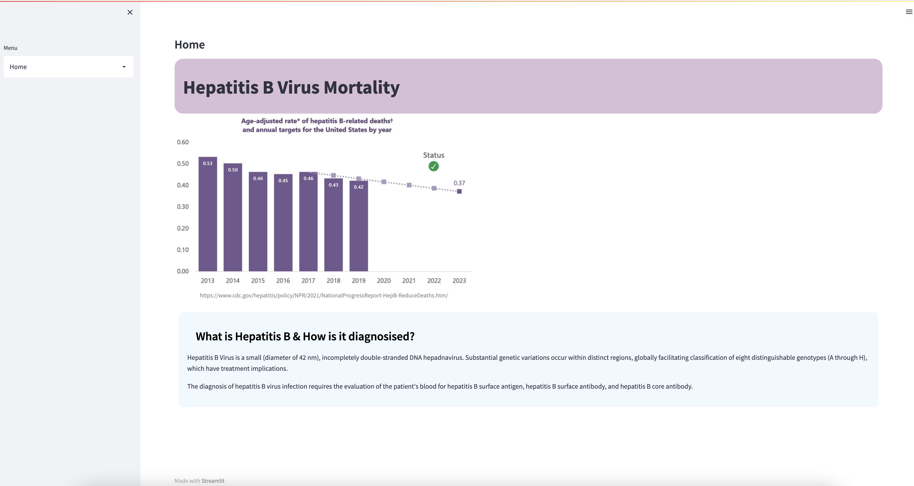
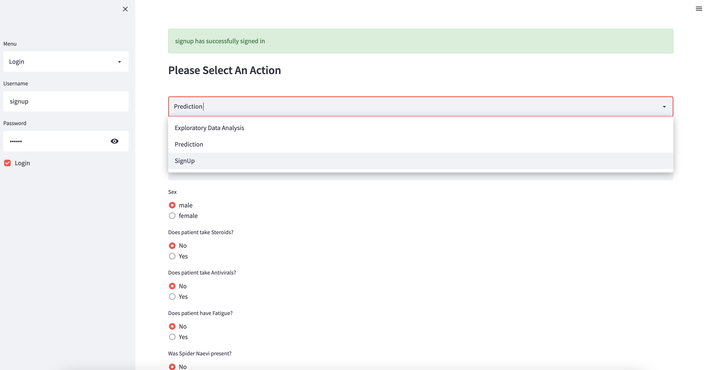

# Hepatitis-B-Mortality
---

### Abstract:

The goal of this project is to build a classification machine learning model to predict Hepatitis B mortality. A pipeline was built to collect the data and store it in an SQL database to perform machine learning to predict if the patient will die or survive based on the patients's blood work results. 

An app was built using Streamlit and deployed on Heroku. The app allows for a user to create an account to login which is stored in SQlite3 database with the passwords hashed. Once the user has logged in, they can input the patient's test results and allow for the classification model to predict the expected results. 

---

### Design:

 A pipeline was built to collect the data and perform machine learning to predict if the transaction was fraud and deployed an app to show the results. 

---

### Data:

The data is from UCI Machine Learning Repository. 

To access and view a detailed description of the dataset, ([UCI Hepatitis Data]([https://archive.ics.uci.edu/ml/datasets/hepatitis])

[CLICK HERE]([https://www.kaggle.com/mathchi/churn-for-bank-customers](https://archive.ics.uci.edu/ml/datasets/hepatitis])

Attribute Information:

1. Class: DIE, LIVE
2. AGE: 10, 20, 30, 40, 50, 60, 70, 80
3. SEX: male, female
4. STEROID: no, yes
5. ANTIVIRALS: no, yes
6. FATIGUE: no, yes
7. MALAISE: no, yes
8. ANOREXIA: no, yes
9. LIVER BIG: no, yes
10. LIVER FIRM: no, yes
11. SPLEEN PALPABLE: no, yes
12. SPIDERS: no, yes
13. ASCITES: no, yes
14. VARICES: no, yes
15. BILIRUBIN: 0.39, 0.80, 1.20, 2.00, 3.00, 4.00
-- see the note below
16. ALK PHOSPHATE: 33, 80, 120, 160, 200, 250
17. SGOT: 13, 100, 200, 300, 400, 500,
18. ALBUMIN: 2.1, 3.0, 3.8, 4.5, 5.0, 6.0
19. PROTIME: 10, 20, 30, 40, 50, 60, 70, 80, 90
20. HISTOLOGY: no, yes

---

### Machine Learning Algorithms:

Machine Learning classification algorithms:
1.	Logistic Regression
2.	DecisionTree

---

### TOOLS:

The following tools were used in this project:
1.	SQL, Python & Pandas to clean, explore and generate the final modeling data
2.	Matplotlib and Seaborn to generate visualizations
3.	SKLearn to build Machine Learning classification models and measuring metrics
4.	Streamlit to develop the app.
5.	Heroku to deploy the app.
6.	Docker to create a smooth pipeline.

---

### Communication:

The findings and slide deck accompanying this project's presentation are accessible in this GitHub repository.

